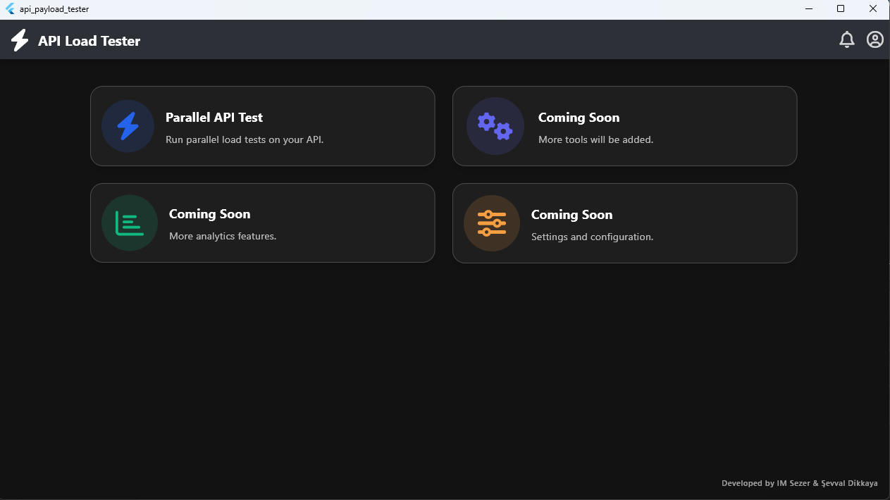
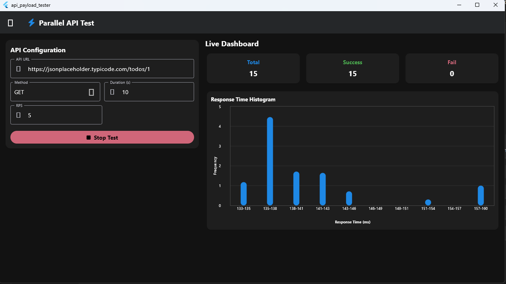

# API Payload Tester

API Payload Tester is a Flutter application designed for load testing APIs. It allows you to run parallel API tests and visualize the results with a live dashboard, including response time histograms.

## Features

-   **Parallel API Testing**: Configure and run load tests with multiple parallel requests.
-   **Live Dashboard**: Monitor test progress with real-time updates on total requests, successes, and failures.
-   **Response Time Histogram**: Visualize the distribution of API response times.
-   **Configurable Parameters**: Set API URL, HTTP method, requests per second (RPS), and test duration.

## Screenshots

### Home Page

### Parallel API Test Page

## Getting Started

This project is a starting point for a Flutter application.

A few resources to get you started if this is your first Flutter project:

-   [Lab: Write your first Flutter app](https://docs.flutter.dev/get-started/codelab)
-   [Cookbook: Useful Flutter samples](https://docs.flutter.dev/cookbook)

For help getting started with Flutter development, view the
[online documentation](https://docs.flutter.dev/), which offers tutorials,
samples, guidance on mobile development, and a full API reference.

## Releases

Currently, there is a release available for **Windows**. You can find it in the `releases/windows` directory.
